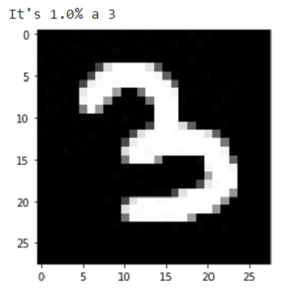

# MNIST handwritten digits

## MNIST dataset:
MNIST is a collection of handwritten digits from 0-9. 
Image of size 28 X 28

## Introduction
MNIST contains 70,000 images of handwritten digits: 60,000 for training and 10,000 for testing. The images are grayscale, 28x28 pixels, and centered to reduce preprocessing and get started quicker.

## Description
This is a 5 layers TF Keras Functional API Convolutional Neural Network for digits recognition trained on MNIST dataset.

| Layer (type)  | Output Shape  | Param #  		|
| ------------- | :-------------: | :-------------: |
| InputLayer  	| [(28, 28, 1)]	| 0   	|
| Conv2D   		| (25, 25, 10)  | 170   |
| MaxPoolin   	| (12, 12, 10)  | 0   	|
| Conv2D   		| (11, 11, 20)  | 820   |
| MaxPoolin   	| (5, 5, 20)   	| 0   	|
| Conv2D   		| (4, 4, 60)   	| 4860	|
| MaxPoolin   	| (2, 2, 60)   	| 0   	|
| Conv2D   		| (1, 1, 100)  	| 24100	|
| Dropout   	| (1, 1, 100)  	| 0 	|
| Flatten   	| (100)   		| 0 	|
| Dense   		| (10)   		| 1010 	|

Total params: 30,960
Trainable params: 30,960
Non-trainable params: 0

## Accuracy
It achieved 99.31% of accuracy on train set of this CNN model trained on GPU.

It achieved 98.98% of accuracy on test set of this CNN model trained on GPU.

## Samples

